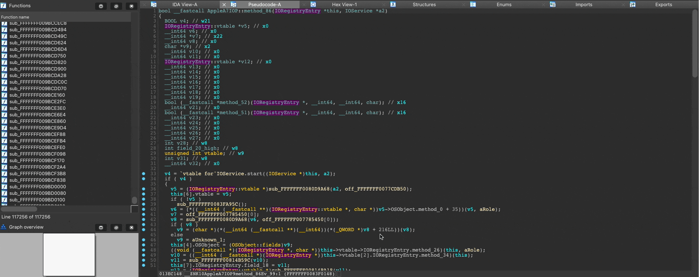
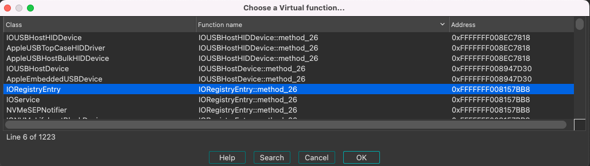

# ida_kcpp

An IDAPython module for way more convienent way to Reverse Engineering iOS kernelcaches.

Big part of the iOS kernelcache is written by C++, which compiled into complicated binary code use many virtual table derefences rather than explicit direct calls.`ida_kcpp` takes the advanteage of `ida_kernelcache` classes hierarchy reconstruction. It maps the IDB and synchronizes the binary functions and the original virtual methods. It enables navigation through the iOS kernelcache by double-clicking on c++ virtual methods call, finding their xrefs, and keeping all of it synchronized during live research.

`ida_kcpp` is inspired by [ida_medigate](https://github.com/medigateio/ida_medigate) but benefits from the unique structure of the iOS kernelcache and provides more powerful and convenient research environment.



# Installation

1. Install  [ida_kernelcache(Cellebrite's fork)](https://github.com/cellebrite-srl/ida_kernelcache)
1. Make sure `ida_kernelcache` and `ida_kcpp` are in IDA python path.

Could also be added by adding into `~/.idapro/idapythonrc.py`:

```python
import sys
sys.path.append(IDA_KCPP_PATH)
sys.path.append(IDA_KERNELCACHE_PATH)
```

2. clone the repository and symlink  `~/.idapro/plugins/ida_kcpp_plugin.py` to `ida_kcpp_plugin.py`
2. Install [ida-netnode](https://github.com/williballenthin/ida-netnode)
2. [Optional]: Install [ida-referee](https://github.com/joeleong/ida-referee) if decompiler structs fields xrefs tracking is required

# Usage

## Preliminary Analysis

1. Open analyzed kernelcache. If `ida_kernelcache` has not run yet, please run it `edit >> Plugins >> Kernel Cache CPP  >> ida_kernelcache process kernel`
2. Run `Edit >> Plugins >> Kernel Cache CPP >> Perform Initial sync...` (Some warning messageboxes might appear, you can ignore them for now).  This step renames Virtual functions names by setting their prefix to the class they belong. This step also decompiles all the virtual functions, sets their `this` argument, and changes the relevant `::vmethods` member to be a function pointer to the decompiled type. **This step can take a while...**
3. Now there is a "Synced IDB", but **pay attention - the plugin isn't activated yet.**

## Plugin activating for a synced IDB

`ida_kcpp` automatically propagates names and prototypes, and also changes some aspects of navigation in IDA, hence is not activated automatically but at any point may be activated or deactivated.

Activate `ida_kcpp` by clicking on `edit >> Plugins >> Kernel Cache CPP >> Activate Plugin` (This will install the Hexrays hooks and also run `ida_kernelcache.collect_class_info()`)

## Deactivate the plugin

clicking on `Edit >> Plugins >> Kernel Cache CPP >> Deactivate Plugin`

# Features overview

## Virtual functions synchronizer

### Virtual function renaming

**When renaming a virtual function** one may edit the mangled name (for example `__ZNK10AppleA7IOP9method_86Ev_99`), or change it to human-being names (`AppleA7IOP::method_86`) which will be mangled automatic. The relevant `ANCESTOR::vmethods`  member will be renamed as well, and also all of the virtual functions that implement the same virtual method will be renamed too.

### Virutal function prototype updating

The same goes for **virutal function prototype changing**. In this case, the relevant `ANCESTOR::vmethods` member's prototype will be changed to a function pointer to the type that just was set, with setting `this` as `ANCESTOR *`. Also, the prototypes of all of the relevant virtual method implementations of the ANCESTOR's DESCENDANTS will be changed, with setting their `this` to `DESCENTANT *`.

## Improved XREFS

* We add an xref from every virtual function to it's abstract `::vmethods` member.
* Using `ida_referee` we can track uses of every field, and especially `::vmethods` member (virtual calls) in the decompiler.
  * We also added `CTRL+SHIFT+Y` hotkey from virtual function, to directly opening the xrefs window to its relevant `::vmethod` member. *IDA has a bug and this only works from the disassembly window and not from the decompiler.*

## Improved Navigation

* Decompiler: Double click on a virtual function call pops up a window that allowing the user to choose the implementation of the virtual method.

  

* Structures window:

  * Double click on virtual method pops up the same window as in the decompiler
  * Fixed an IDA bug that double-click on struct name that contains `::` won't jump.

# Future improvements

1. Adding support in IDA7.2 c++ classes compatibility. Require changing ida_kernelcache structs layout which we didn't do yet for legacy reason
2. Adding a name/prototype resolving interface for conflicts.

# Meta

Authored by Uriel Malin and Ievgen Solodovnykov of Cellebrite Labs. 
Developed and tested for IDA8.0 on macOS with python 3.10.2
